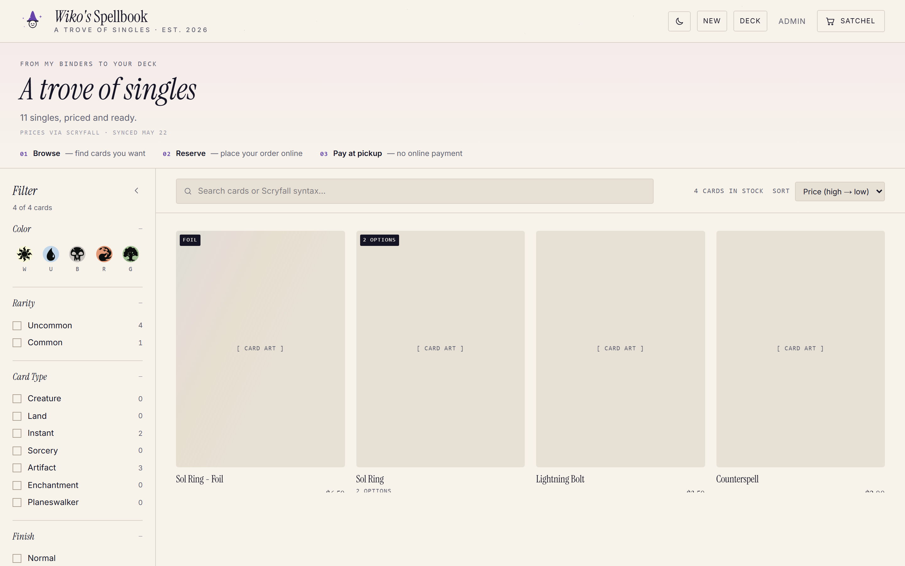
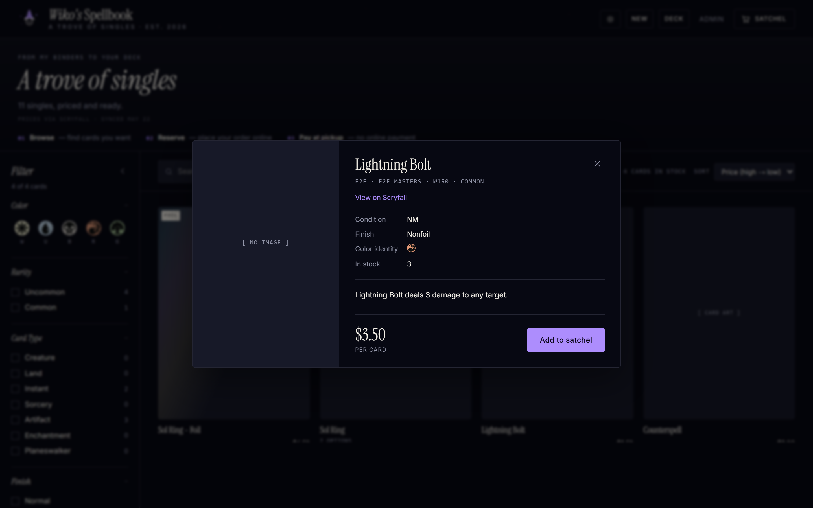
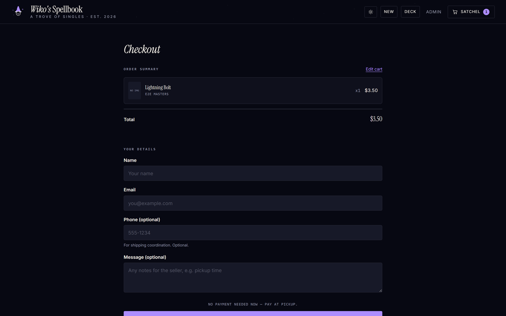
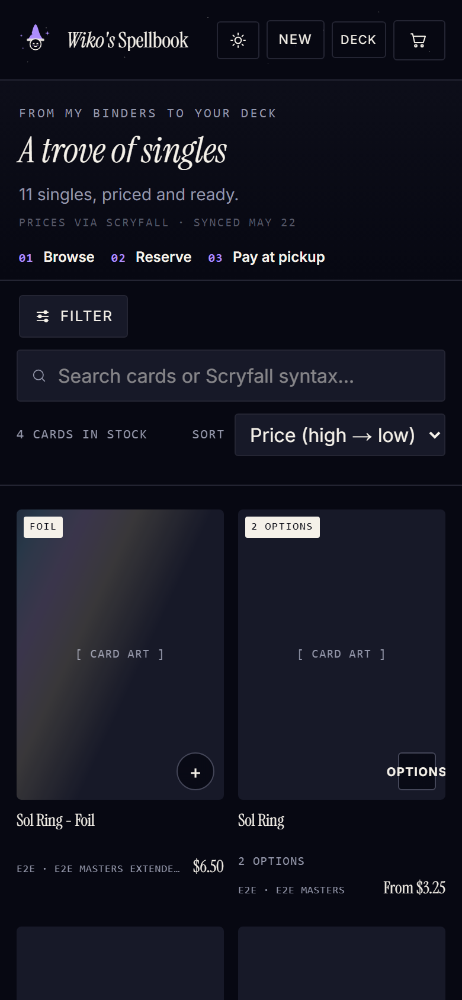

<div align="center">

# 🧙‍♂️ Wiko's Spellbook

**A trove of singles — the friend-shop for my Magic: The Gathering collection.**

Friends browse the live inventory, reserve cards in a couple of taps, and pay in person at pickup.
No accounts, no payment processor, no marketplace fees — just a binder collection with a really nice storefront.

<p>
  <a href="https://wikospellbinder.com"><b>🔮 Visit the live shop</b></a>
</p>

<p>
  
  
  
  
  
  
  
  
  
  
  
</p>

</div>


<table>
  <tr>
    <td align="center" width="50%">
      
      <br /><sub><b>Parchment light theme</b> — one toggle, zero flash</sub>
    </td>
    <td align="center" width="50%">
      
      <br /><sub><b>Card details</b> — finishes grouped, oracle text, mana symbols</sub>
    </td>
  </tr>
  <tr>
    <td align="center" width="50%">
      
      <br /><sub><b>Checkout</b> — reserve now, pay in person at pickup</sub>
    </td>
    <td align="center" width="50%">
      
      <br /><sub><b>Mobile-first</b> — most buyers shop from their phone</sub>
    </td>
  </tr>
</table>

> Screenshots show the built-in fixture mode (placeholder card art). The live shop renders real Scryfall card images.

---

## The shop, in one minute

- **Browse a live inventory** aggregated straight from Postgres — one tile per printing, with regular / foil / etched copies grouped into a variant picker. Double-faced cards flip. Foils shimmer.
- **Search like a Magic player** — instant filtering by name (with Scryfall-style syntax: `t:instant`, `c<=ur`, `mv>=4`), mana color, set, rarity, type, finish, and price.
- **Deck check** — paste a Moxfield or Archidekt link (or any exported decklist) and the shop tells you exactly which cards it stocks, suggests the best-condition printing of each, totals it up, and adds the lot to your satchel in one click.
- **The Satchel** — a cart that survives reloads and *heals itself*: quantities clamp to live stock and stale entries migrate or drop on every visit.
- **Checkout without the checkout** — name + email is all it takes. No account, no card number. Stock is decremented atomically; you pay in person when you pick up.
- **Receipts for both sides** — buyer and seller each get an email the moment an order lands (and an email outage can never lose an order).
- **New arrivals** (`/new`) — whatever the latest binder import added, newest first.
- **Dark & light themes** — Arcane midnight by default, warm parchment if you prefer; applied pre-paint with no flash.

## The back office

Everything the shopkeeper needs lives behind a Google-OAuth login locked to a single admin email:

- **Inventory** — paginated table over every per-binder row: inline price/quantity/condition editing, a "change printing" dialog that re-resolves against Scryfall, bulk delete, CSV export, and a typed-confirmation danger zone.
- **ManaBox import** (`/admin/import`) — drag in CSV exports, pick exactly which binders to replace (with NEW / will-delete annotations), preview after Scryfall enrichment, then commit a scoped per-binder replace behind a typed `REPLACE` confirmation.
- **Orders** (`/admin/orders`) — a queue-first workflow with status tabs, search, private notes, cancellation with optional stock restore, and a per-order audit timeline.
- **Pick batches** (`/admin/orders/pick`) — select orders and get one walk-path list sorted binder → set → name, with per-card *Got it / Missing* toggles and one-tap bulk confirmation. Built to be used standing at the binders, phone in hand.
- **Price intelligence** — a Vercel cron refreshes every card's Scryfall price daily at 09:00 UTC (manual trigger on `/admin/health`); the **Price Movers** report ranks what jumped since the last snapshot.
- **ManaBox removals** (`/admin/manabox`) — a printable checklist of sold cards to mirror back into the ManaBox catalog app.
- **W-binders** (`/admin/w-binders`) — a private storefront-style browser for the operator's personal collection, which is invisible to (and unsellable by) the public shop.
- **Audit & health** — an append-only audit log of every high-impact mutation, import history per CSV commit, and a health page reporting DB reachability and env configuration (as `Configured`/`Missing` — never values).
- **QA gates** (`/qa`) — a lightweight pre-release review surface where a trusted reviewer watches recorded proof runs and signs off.

## How it's built

| Layer | Choice |
|---|---|
| Framework | Next.js 16 (App Router) · React 19 · TypeScript 5 |
| Styling | Tailwind CSS v4 + a hand-rolled token system (oklch scene tokens, Instrument Serif / Inter / Geist Mono) |
| Database | Neon Postgres via `@neondatabase/serverless` (neon-http) |
| ORM | Drizzle ORM + Drizzle Kit |
| Auth | Auth.js v5 — Google OAuth, single-admin allowlist, dev-only password fallback |
| Email | Resend |
| Client state | Zustand (cart, filters, import & pick stores; localStorage persistence) |
| CSV | PapaParse |
| Card data | Scryfall API (images, prices, oracle text — no key required) |
| Tests | Vitest + Testing Library + happy-dom · Playwright (chromium + webkit) |
| Hosting | Vercel (free tier) + Neon (free tier) |

### Engineering notes worth reading

<details>
<summary><b>The checkout is one SQL statement</b></summary>

The neon-http driver has no interactive transactions, so the entire checkout — lock every matching per-binder row (`FOR UPDATE OF cards`), allocate the order across binders in deterministic binder order, decrement stock, insert the order and its line items — runs as **a single CTE chain** in one `db.execute`. All-or-nothing: a conflict returns exactly which cards fell short ("requested 3, available 1"), and a schema-level `CHECK (quantity >= 0)` makes silent overselling structurally impossible (a violation surfaces as HTTP 503, never a sold card you don't have). See `src/db/orders.ts`.

</details>

<details>
<summary><b>Binder locations can't leak — the type system enforces it</b></summary>

Inventory rows carry a 5-segment composite key `${set}-${collector}-${finish}-${condition}-${binder}` so the same printing can live in multiple physical binders. But binder names are real-world locations, so the storefront only ever sees `PublicCard` — a type with no binder fields, produced by `toPublicCards()` at the server boundary. The admin's `AdminCard` extends it. A leak is a compile error, not a code-review hope. Binders whose name starts with `w` are the operator's personal collection and are excluded from every public query *and* the checkout allocator. See `src/lib/types.ts`, `src/lib/public-card.ts`, `src/lib/binder-scope.ts`.

</details>

<details>
<summary><b>The card grid is hand-virtualized</b></summary>

No virtualization library: `src/components/card-grid.tsx` estimates row height, measures the real one from rendered tiles, tracks the column count from computed styles, and renders only the visible window plus overscan — the DOM stays bounded no matter how many thousands of cards are in stock (there's an e2e spec that proves it with a 1,200-card synthetic inventory).

</details>

<details>
<summary><b>Imports stream in two stages to respect Scryfall</b></summary>

CSV import previews stream NDJSON: stage one parses and returns the binder list so the operator can choose a subset; stage two enriches **only the selected binders** against Scryfall (120 ms request gap, retry/backoff, in-process cache). Commits are scoped `DELETE WHERE binder IN (…)` replaces, recorded in both the audit log and an `import_history` table. See `src/app/api/admin/import/`.

</details>

<details>
<summary><b>Serverless-honest infrastructure</b></summary>

Rate limiting is a Postgres-backed sliding window (lazily-created table, single-statement check-and-record, fails *open*) because in-memory counters are meaningless across serverless instances: checkout 10/min before body parse, admin mutations 60/min *after* auth so unauthenticated callers always see 401, never 429. The daily price refresh single-flights through a row-lease (`INSERT … ON CONFLICT` with stale takeover) because advisory locks don't survive neon-http's per-statement sessions. See `src/lib/rate-limit.ts`, `src/lib/price-refresh.ts`.

</details>

---

## Getting started

```bash
npm install
cp .env.local.example .env.local   # then fill in values — see the env table
npm run dev                        # http://localhost:3000
```

### Run it with **no database at all**

The repo ships a deterministic fixture mode — the same one the e2e suite uses:

```bash
E2E_FIXTURES=1 npm run dev   # PowerShell: $env:E2E_FIXTURES="1"; npm run dev
```

Storefront, cart, deck check, and the admin data surfaces all render from in-memory fixtures: no Postgres, no Google OAuth, no Resend key. (Hard-disabled in production builds.) This is also why `npm run test:e2e` works on a fresh clone with zero setup.

### Environment variables

| Key | Needed for | Notes |
|---|---|---|
| `DATABASE_URL` | everything Postgres + `npm run build` | Neon connection string |
| `AUTH_SECRET` | Auth.js (all envs) | `openssl rand -base64 32` |
| `ADMIN_EMAIL` | admin authorization | exact, case-sensitive match against the Google account |
| `AUTH_GOOGLE_ID` / `AUTH_GOOGLE_SECRET` | Google OAuth | required in preview/production; optional locally |
| `RESEND_API_KEY` | order emails | orders still commit if email fails |
| `SELLER_EMAIL` | order emails | inbox for `[ORDER]` notifications |
| `ORDER_EMAIL_FROM` | order emails (optional) | defaults to `Wiko's Spellbook <orders@wikospellbinder.com>`; must be Resend-verified if changed |
| `CRON_SECRET` | production price-refresh cron | route fails closed (401) when unset |
| `ENABLE_PASSWORD_LOGIN` | local dev only | force-disabled in production regardless |
| `ADMIN_USERNAME` / `ADMIN_PASSWORD` | local dev password login | never used in production |
| `QA_GATE_PASSWORD` / `QA_GATE_COOKIE_SECRET` | `/qa` review gate (optional) | cookie secret falls back to `AUTH_SECRET` |
| `AUTH_URL` | optional | set in production with a custom domain |

| Environment | `DATABASE_URL` | `AUTH_SECRET` | Google OAuth | Resend + seller | `CRON_SECRET` | password login |
|---|---|---|---|---|---|---|
| Local dev | required | required | optional | optional | – | on (default) |
| Preview | required | required | required | required | – | forced off |
| Production | required | required | required | required | required | forced off |

## Testing

```bash
npm test              # Vitest — 652 unit/component tests (happy-dom opt-in per file)
npm run test:e2e      # Playwright — 54 tests (52 in the default run), chromium + webkit, fully self-contained (fixture mode)
npm run test:all      # lint + unit + build + e2e, the same order CI runs
```

- **Opt-in DB suites:** set `TEST_DATABASE_URL` to a **disposable Neon branch** (the tests insert and delete rows) to enable concurrency proofs like the double-checkout race in `src/db/__tests__/orders.concurrent.test.ts`. Most self-skip without it; two query-shape tests in `queries-aggregated.test.ts` fail locally without the variable (CI supplies it as a secret).
- **Opt-in scale test:** `E2E_BULK_FIXTURE_COUNT=1200 npm run test:e2e` exercises the virtualized grid against a synthetic 1,200-card inventory.
- **Perf pin:** parsing the checked-in 12,749-row ManaBox CSV fixture must stay under 2 s (`csv-parser-perf.test.ts`).

CI (`.github/workflows/test.yml`) runs lint (informational) → unit → build → e2e on every PR and push to `main`, uploading Playwright traces on failure. A second workflow smoke-tests the production deployment every 6 hours, read-only.

## Operations

<details>
<summary><b>Deploy checklist</b></summary>

1. Push to `main` (Vercel deploys) with every env var from the table set for the target environment.
2. Ensure the Neon schema is current — schema changes are **manual operator-run scripts** (`npm run migrate:*`), each with a `:dry-run` variant to rehearse against a Neon branch first. All are idempotent and print the timestamps you'd need for a point-in-time restore.
3. Run the post-deploy smoke: `npm run smoke:production -- --deployment https://your-app.vercel.app` — five guard checks that never touch production data, including an unauthenticated `DELETE` probe that hard-fails if the admin guard ever lets it through (use `smoke:production:readonly` to skip that probe). Supports `--bypass-token` for Vercel deployment protection and `--json` for log drains.
4. Open `/admin/health` and confirm everything reads `Configured` / `OK`.

</details>

<details>
<summary><b>Runbook — where to look when something breaks</b></summary>

| Symptom | Look at |
|---|---|
| Orders not placing | Vercel function logs: `checkout.db_failed`, `checkout.stock_conflict`, `checkout.rate_limited` |
| Order placed, email missing | `notification.seller_email_failed` / `notification.buyer_email_failed` — the order is still committed, by design |
| Prices stale | `cron.refresh_prices.*` events; `lastPriceRefreshAt` on `/admin/health`; manual refresh button there |
| Admin sees 403 after Google login | `ADMIN_EMAIL` mismatch — comparison is exact and case-sensitive |
| 429s on admin actions | sliding-window limits in `src/lib/rate-limit.ts` (checkout 10/min, mutations 60/min, bulk 20/min) |

**Backups:** CSV-export the inventory from `/admin` before any destructive import (the export re-imports cleanly), and `pg_dump "$DATABASE_URL" --no-owner --no-privileges` for the full database — store dumps outside the repo, they contain buyer PII. `admin_audit_log` and `import_history` are append-only forensic tables; never truncate them.

</details>

## Project documentation

- [`.planning/PROJECT.md`](.planning/PROJECT.md) — product framing, validated requirements, and the full decision log
- [`.planning/`](.planning/) — per-phase plans, research, verification records, and retrospectives for every milestone since v1.0
- [`docs/`](docs/) — design plans and operational notes

## License

Private project. All rights reserved — this is one person's card collection, not a platform. But if the architecture is useful to you, take the ideas.
