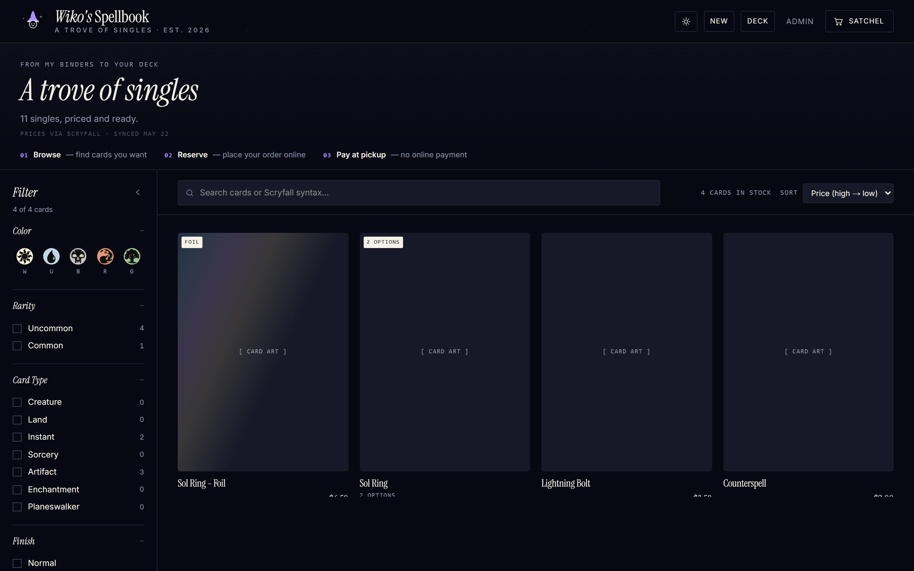

<div align="center">

# Viki — MTG Bulk Store

**A small, friend-only online store for selling Magic: The Gathering bulk cards.**

Live inventory backed by Postgres, Google-OAuth-protected admin panel, and one-tap checkout that emails buyer and seller. Built for the case where you have a binder of cards, a few friends, and zero patience for a real e-commerce platform.

<p>
  
  
  
  
  
  
  
  
  
  
</p>

</div>

---

## Screenshots

<table>
  <tr>
    <td align="center" width="50%">
      
      <br />
      <sub><b>Storefront</b> — browse, filter, add to cart</sub>
    </td>
    <td align="center" width="50%">
      
      <br />
      <sub><b>Cart &amp; checkout</b> — confirm order, notify seller</sub>
    </td>
  </tr>
  <tr>
    <td align="center" width="50%">
      
      <br />
      <sub><b>Admin inventory</b> — edit cards, CSV import/export</sub>
    </td>
    <td align="center" width="50%">
      
      <br />
      <sub><b>Orders &amp; audit</b> — mark fulfilled, audit trail</sub>
    </td>
  </tr>
</table>

> Drop captures into `docs/screenshots/` — paths above are placeholders.

---

## Features

- **Public storefront** with live inventory aggregated by card, foil, and condition. Double-faced cards flip; foils are labeled.
- **Cart and checkout** that decrements stock atomically. Payment is settled in person; the system emails both buyer and seller a receipt via Resend.
- **Google-OAuth admin panel** locked to a single `ADMIN_EMAIL`. Local username/password fallback exists in dev and is force-disabled in production.
- **CSV import and export** for the inventory. Full-replace imports show an export-first reminder; every commit is recorded in `import_history`.
- **Audit log** for every admin mutation, append-only. Order timeline is visible from `/admin/orders`.
- **Operational health page** at `/admin/health` showing DB reachability, env configuration (`Configured` / `Missing` — never values), and last-activity timestamps.
- **Production smoke script** that hits the deployed app and asserts auth, guards, and shell rendering without ever mutating data.
- **Rate-limited admin mutations** (Phase 15-01) with auth-before-rate-limit ordering, so unauthenticated callers cannot tarpit the limiter.

---

## Tech stack

| Layer            | Choice                                                                 |
|------------------|------------------------------------------------------------------------|
| Framework        | Next.js 16 (App Router) · React 19 · TypeScript 5                       |
| Styling          | Tailwind CSS v4                                                         |
| Database         | Neon Postgres via `@neondatabase/serverless`                            |
| ORM / migrations | Drizzle ORM + Drizzle Kit                                               |
| Auth             | Auth.js v5 (Google OAuth, single-admin allow-list)                      |
| Email            | Resend                                                                  |
| State (client)   | Zustand                                                                 |
| CSV              | PapaParse                                                               |
| Tests            | Vitest · Testing Library · happy-dom                                    |
| Host             | Vercel                                                                  |

---

## Quick start

```bash
npm install
cp .env.local.example .env.local      # fill in values — see env table below
npm run dev                            # http://localhost:3000
npm test                               # full Vitest suite
npm run build                          # production build (requires .env.local)
```

Then visit:

- <http://localhost:3000> — public storefront
- <http://localhost:3000/admin> — admin (Google in prod, username/password in dev)
- <http://localhost:3000/admin/health> — every check should read `Configured` / `OK`

---

## Environment variables

All env keys are listed in `.env.local.example`. The admin health page (`/admin/health`) reports which categories are `configured` vs `missing` so an operator can verify configuration without ever seeing the values themselves.

| Key                     | Required by              | Notes |
|-------------------------|--------------------------|-------|
| `DATABASE_URL`          | All Postgres reads/writes | Neon connection string. `npm run build` also needs it because `/checkout` and admin pages run server queries at build time. |
| `AUTH_SECRET`           | Auth.js v5               | Generate with `openssl rand -base64 32`. |
| `ADMIN_EMAIL`           | Admin authorization      | The single email allowed admin access. |
| `AUTH_GOOGLE_ID`        | Google OAuth             | Google Cloud Console → OAuth 2.0 Client ID. |
| `AUTH_GOOGLE_SECRET`    | Google OAuth             | Google Cloud Console → OAuth 2.0 Client Secret. |
| `RESEND_API_KEY`        | Order notification emails | <https://resend.com/api-keys>. |
| `SELLER_EMAIL`          | Order notification emails | Inbox for `[ORDER]` notifications. |
| `ORDER_EMAIL_FROM`      | Order notification emails | Optional sender identity. Defaults to `Viki MTG Store <orders@wikospellbinder.com>`; use a Resend-verified sender if changed. |
| `ENABLE_PASSWORD_LOGIN` | Local dev only           | `false` to hide the local username/password form. Always disabled in production regardless. |
| `ADMIN_USERNAME`        | Local dev only           | Required when local password login is enabled. |
| `ADMIN_PASSWORD`        | Local dev only           | Required when local password login is enabled. |
| `AUTH_URL`              | Optional                 | Set in production if you use a custom domain (`https://yourdomain.com`). |

### Environment matrix

| Environment | `DATABASE_URL` | `AUTH_SECRET` | `AUTH_GOOGLE_*` | `RESEND_*` + `SELLER_EMAIL` | `ENABLE_PASSWORD_LOGIN` |
|-------------|----------------|---------------|-----------------|------------------------------|--------------------------|
| Local dev   | required       | required      | optional        | optional                     | `true` (default)         |
| Preview     | required       | required      | required        | required                     | forced off               |
| Production  | required       | required      | required        | required                     | forced off               |

---

## Documentation

<details>
<summary><b>Local verification</b></summary>

```bash
npm test                   # full Vitest suite — must be green before push
npx tsc --noEmit           # TypeScript only
npm run build              # production build — catches build-time route issues
```

For interactive smoke locally:

1. `npm run dev`
2. Open <http://localhost:3000> — browse, add to cart, checkout (uses Resend in `re_test_*` mode if you have a test key).
3. Open <http://localhost:3000/admin> — sign in with Google (production-style) or the local username/password form (dev only).
4. Visit <http://localhost:3000/admin/health> — every check should be `Configured` / `OK`.

</details>

<details>
<summary><b>Production smoke script</b></summary>

The repo ships a read-only/guard-focused smoke script that runs the same checks operators have historically done by hand. It never mutates production data — mutation is intentionally not implemented behind a flag, so the only way to exercise authenticated paths in production is the admin UI.

```bash
npm run smoke:production -- --help
npm run smoke:production -- --deployment https://your-app.vercel.app
```

Output:

```
Production smoke against: https://your-app.vercel.app
================================================================
[PASS] GET / -- 200 + HTML
[PASS] GET /admin/login -- Google sign-in visible, password field hidden
[PASS] GET /admin (unauth) -- redirected to /admin/login
[PASS] DELETE /api/admin/cards (unauth) -- 401 from requireAdmin guard
[PASS] GET /api/admin/health (unauth) -- 401 from requireAdmin guard
----------------------------------------------------------------
5 / 5 checks passed
```

Exit code is `0` if every check passes, `1` otherwise. Pipe `--json` for a single JSON line per run if you want to feed it into a log drain.

**Vercel deployment protection.** If the deployment has Vercel Authentication / Deployment Protection enabled, pass a protection bypass token (created in the Vercel dashboard):

```bash
export VERCEL_BYPASS_TOKEN="<from vercel dashboard>"
npm run smoke:production -- \
  --deployment https://your-app.vercel.app \
  --bypass-token "$VERCEL_BYPASS_TOKEN"
```

The token is sent as `x-vercel-protection-bypass` and is never logged. Alternatively, run the script inside a `vercel curl` shell context that already has bypass cookies set.

**Covers:**

- App shell renders (`GET /` returns HTML).
- Admin login page shows Google sign-in.
- Admin login page hides the local password field in production.
- Unauthenticated `/admin` redirects to `/admin/login`.
- Unauthenticated admin mutation API (`DELETE /api/admin/cards`) returns 401 from `requireAdmin()` — proving rate-limit/auth ordering still works (auth must precede rate limit so unauthenticated callers never get tarpitted to 429; see Phase 15-01 SUMMARY).
- Unauthenticated `/api/admin/health` returns 401.

**Does NOT cover (intentionally):**

- Authenticated paths (login flow, order placement, admin mutation).
- Outbound notification delivery (Resend).
- Backup/restore correctness.

</details>

<details>
<summary><b>Operational runbook</b></summary>

### Health page

`/admin/health` (admin-only) shows:

- Database reachability (`SELECT 1`).
- `AUTH_SECRET`, Google OAuth, and email configuration as `Configured` or `Missing` — never values.
- Last order, last import commit, and last audit entry timestamps.
- A `Notification failures (24h)` tile that currently shows `Unknown — log drain not yet wired`. Failure events ARE emitted to Vercel function logs by `src/lib/notifications.ts` (events `notification.seller_email_failed`, `notification.buyer_email_failed`); a queryable count surface is deferred — see Phase 15-01 SUMMARY.

`/api/admin/health` returns the same shape as JSON. Both surfaces are admin-only and never echo env values.

### Backup and export

The store's source of truth is the Neon Postgres `cards` table plus the `orders`, `order_items`, `admin_audit_log`, and `import_history` tables.

Snapshot strategies:

1. **CSV export of inventory.** Use the admin CSV export from the inventory page (`/admin`) before any large destructive operation (full inventory delete or CSV import). The exported file can be re-imported via `/admin/import` if a rollback is needed.
2. **Database snapshot.** Neon supports point-in-time recovery on paid tiers; on the free tier, take a `pg_dump`:
   ```bash
   pg_dump "$DATABASE_URL" --no-owner --no-privileges \
     --file backups/$(date +%Y-%m-%d-%H%M).sql
   ```
   Store the dump outside the repo (it contains buyer PII).
3. **Audit + import history.** Both are append-only tables. They give a durable forensic trail of high-impact mutations independent of the cards table; do NOT truncate them as part of routine cleanup.

Before any full-inventory replace (`/admin/import` commit) the admin UI shows an export reminder and links to `/admin/audit` so the operator can confirm the previous commit before overwriting.

### Failure diagnosis

| Symptom                                | Where to look |
|----------------------------------------|---------------|
| Orders not placed                      | Vercel function logs grouped on `checkout.*` events from `src/lib/logger.ts`. Look for `checkout.db_failed`, `checkout.stock_conflict`, or `checkout.rate_limited`. |
| Order placed but buyer/seller email missing | `notification.seller_email_failed` / `notification.buyer_email_failed` in function logs. Order is still committed — this is intentional (Phase 11 D-17). |
| `/admin/health` shows database error   | Neon project paused or `DATABASE_URL` rotated. Reset connection string in Vercel env, redeploy. |
| `/admin/health` shows Google OAuth missing | `AUTH_GOOGLE_ID` / `AUTH_GOOGLE_SECRET` not configured for the current Vercel environment. |
| Admin can sign in but sees 403         | `ADMIN_EMAIL` does not match the signed-in Google email exactly (case-sensitive comparison; see `src/lib/auth/helpers.ts`). |
| 429 on admin mutation                  | Phase 15-01 rate limit triggered. Bucket thresholds are in `src/lib/rate-limit.ts` (`RATE_LIMIT_BUCKETS`). |

</details>

<details>
<summary><b>Deploy on Vercel</b></summary>

1. Push to the branch that Vercel deploys (usually `main`).
2. Set every env var from the table above in the Vercel project for the target environment (Production / Preview / Development).
3. Ensure the Neon Postgres database has all required schema: `cards`, `orders`, `order_items`, `admin_audit_log`, `import_history`, and the lazily-created `rate_limit_hits` (created on first rate-limited call; see Phase 15-01 SUMMARY).
4. Run `npm run smoke:production -- --deployment <url>` from a workstation immediately after deploy.
5. Sign in to `/admin/health` and confirm every check is green.

</details>

---

## Project documentation

- [`.planning/PROJECT.md`](.planning/PROJECT.md) — product context, validated requirements, decisions.
- [`.planning/REQUIREMENTS.md`](.planning/REQUIREMENTS.md) — requirement registry (OPS-01 .. OPS-05 cover this phase).
- [`.planning/phases/15-production-hardening/`](.planning/phases/15-production-hardening/) — production-hardening phase plans, context, and security review artifact.

---

## License

Private project. All rights reserved.
